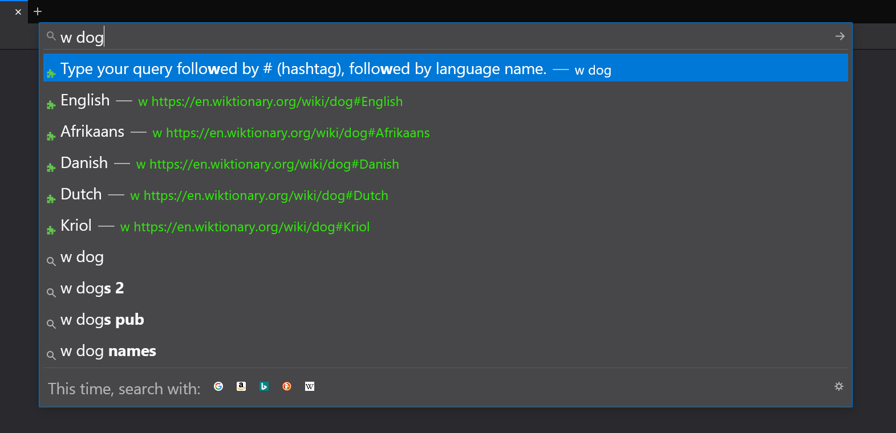
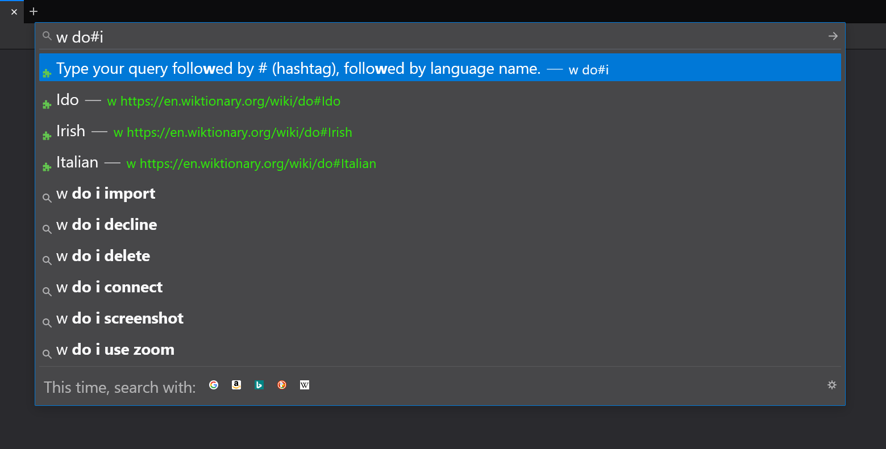

## wiktionary-suggestions

[Wiktionary Suggestions extension for Firefox.](https://addons.mozilla.org/en-US/firefox/addon/wiktionary-suggestions)

Allows user to easily go to a Wiktionary entry in a specific language.

To use the extension:

- type w into your browser's search bar
- you'll see the first 5 (or less, if less exist) languages available
- type # followed by a language's name to get specific languages

Only available for English Wiktionary.

